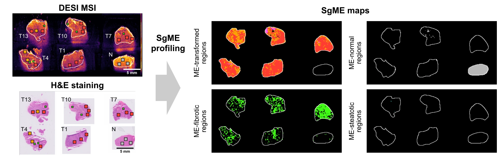

Spatially-guided MEtabolomics (SgME) profiling of heteregenous human tumor
tissues and deconvolution of metabolic-region compositions
===========================================================================

### Study corresponding authors
* Lit-Hsin Loo, Bioinformatics Institute, A*STAR, Singapore (loolh@bii.a-star.edu.sg)
* Pierce Kah-Hoe Chow, National Cancer Centre Singapore, Singapore (pierce.chow@duke-nus.edu.sg)
* Yulan Wang, Singapore Phenome Center, Lee Kong Chian School of Medicine, Nanyang Technological University, Singapore (yulan.wang@ntu.edu.sg)

Study abstract
--------------
Bulk high-resolution mass spectrometry can provide sensitive and global snapshots of metabolites involved in cancer metabolism. However, intra-tumor heterogeneity (IntraTH) convolutes the cellular origins and tumor pathologies associated with the detected metabolites, thus making the selection of reproducible metabolic markers and the elucidation of the metabolic pathways and processes in cancer cells very challenging. Here, we present “Spatially-guided MEtabolomics (SgME) profiling”, a multi-omics data analysis approach to delineate IntraTH by integrating spatial and bulk metabolomics and transcriptomics profiles from the same tumors. We applied SgME profiling to 117 tumor and adjacent normal tissues from 26 surgically resected primary liver tumors, and constructed SgME maps of metabolic regions (MERs) associated with key histopathological features. We used these maps to survey IntraTH and to train regression models that can accurately predict the MER compositions of bulk tumor samples. We also discovered a group of putative metabolites that increase in low-grade tumor regions but abruptly decrease in necrotic regions. Our approach is general and may be applied to heterogenous tissues from cancers or other metabolic diseases.




Data availability
-----------------
### Spatial data
The raw spatial data, including H&E images (16GB), DESI-MSI images (306GB),
and STx profiles (1.3GB), for all the samples used in the study can be downloaded
from https://data.cellXpress.org/2401-sgme-hcc.
  
### Bulk RNA-seq data
The raw RNA-seq data used in the study can be downloaded from the European 
Genome-Phenome Archive (https://ega-archive.org/datasets/EGAD00001008648 and 
https://ega-archive.org/datasets/EGAD00001009042)

### Pre-processed data
All the pre-processed data and annotations used in the study are available under
the `data` directory of this git repository. They will be downloaded together 
with the code when the git repository is cloned.

| Data type              |  Size | Path name             | File type  |
|------------------------|------:|-----------------------|------------|
| Clinical and sample information  |  19KB | data/lcms/clinical_info.xlsx | MS Excel file |
| LC-MS aligned profiles |  13MB | data/lcms/lcms_raw.rds| R RDS file |
| LC-MS HiPM profiles | 3MB | data/lcms/lcms_peaks.Rdata | R Rdata file |
| DESI-MSI CPPs profiles | 407KB | data/msi/prominent_peaks/* | R Rdata file |
| DESI-MSI HiPM profiles | 25MB | data/msi/ref_peaks/* | R Rdata file |
| DESI-MSI ROI annotations | 107MB | data/roi/*.zip | ImageJ ROI file |
| RNA-seq raw profiles   | 4.2MB | data/RNA/RNA_data.Rdata | R Rdata file |
| RNA-seq normalized profiles | 44MB | data/RNA/RNA_normalized_data.Rdata | R Rdata file |
  

Code overview
-------------
The code was developed using `R v4.3.1` and `Bioconductor v3.17` under
Linux (Gentoo 2.14) and an PC (Intel i9-7940X). It should work under newer 
versions of R and libraries or other operating systems.

The following directories will be generated and populated after running the code:

| Directory name     | Purpose                                        | File formats|
|--------------------|------------------------------------------------|-------------|
| `results`          | Results and models generated by SgME profiling | R Rdata file|
| `outputs`          | Data generated by SgME profiling | CSV files|
| `images/SgME_Maps` | SgME maps                   | TIFF files |
| `figures`          | Graphs and heatmaps         | PDF and PNG files |


Running the SgME profiling code for the HCC study
-------------------------------------------------
1. Clone the git repository to a desired project location. Depending on the
   network connection speed, the cloning usually takes < 1 min to complete.
   ```console
   $ cd $desired_project_location
   $ git clone https://github.com/ccpagroup/sgme-hcc.git
   ```   

2. (Optional) Download the STx profiles to a desired data location. This is only
   needed for the spatial transcriptomics analysis in Step 5 and Fig 4l.
   
   ```console
   $ cd $desired_data_location
   $ wget https://data.cellXpress.org/2401-sgme-hcc/stx/STx_profiles.tar.xz
   $ wget https://data.cellXpress.org/2401-sgme-hcc/stx/md5sum.txt
   $ md5sum -c md5sum.txt
   $ tar -xvf STx_profiles.tar.xz
   $ rm STx_profiles.tar.xz
   $ rm md5sum.txt
   ```

   Set the location of the STx profiles by updating the configuration file,
   `conf/study_conf.R`, using a text editor.

   ```R
   ### Define the location of the STx profiles for F008_CA and F011_CA
   visium_raw_dir <- "$desired_data_location/STx_profiles"
   ```


3. Run the R environment
   ```console
   $ cd $desired_project_location/sgme-hcc
   $ R
   ```

4. Install bioconductor and all the required libraries
   ```R
   if (!require("BiocManager", quietly = TRUE))
       install.packages("BiocManager")
   
   BiocManager::install(version = "3.17")
   
   BiocManager::install(c(     
      "ComplexHeatmap", "caret", "clusterProfiler", "DESeq2", 
      "dendsort", "doParallel", "e1071", "enrichplot", "fs", 
      "ggbeeswarm", "ggpmisc", "ggpubr", "ggrastr", "ggrepel", 
      "ggupset", "glmnet", "here", "ijtiff", "jsonlite", 
      "MetaboCoreUtils", "MsCoreUtils", "org.Hs.eg.db", 
      "parallel", "png", "pROC", "RColorBrewer", "RImageJROI",
      "readxl", "ropls", "rstatix", "Seurat", "tidyverse"
   ))
   ```

5. Run all the data processing and analysis steps.
   This must be done before generating all the figures.
   Step 1 usually takes longer (~10-15 mins) to run, while the rest of the steps
   are much faster (~1-5 mins). If a script hangs after the indicated time,
   please close the R session and re-try the script in a new R session.
   ```R
   source("Step1_Find_LCMS_Marker.R")
   source("Step2_Find_Prominent_Peaks-FigS4.R")
   source("Step3_Build_SgME_Map_Classifiers-Fig5ab-S10.R")
   source("Step4_COMETs_Path_Analysis.R")
   source("Step5_Visium_analysis-Fig4l.R")
   source("Step6_SgMERdeconv-Fig6bcdef-S11.R")
   source("Step7_ExportData.R")
   q()
   ```

6. Generate all the figures, which are saved under the `figures/` directories 
   as both PNG and PDF formats. The PDF formats can be imported into Inkscape.
   Each figures will take ~1-3 mins to be generated. 
   It is recommended to run the following scripts under a new fresh R session.
   ```R
   source("Fig1ceg-S2_LCMS_spectrum.R")
   source("Fig1fghij-2d-S3_Find_Stage_AMFs_DEGs.R")
   source("Fig1k-2e_InterTH_and_IntraTH.R")
   source("Fig2bc_Most_abundant_peaks.R")
   source("Fig2hklmn_LCMS_MSI_Comparison.R")
   source("Fig3e_DESI_ROI_Heatmap.R")
   source("Fig3fgh_DESI_HistoPath_Classifiers.R")
   source("Fig3ij_DESI_HistoPath_Perf.R")
   source("Fig4abcdef_DESI_SgME_VIP_vs_Coeff.R")
   source("Fig4j_S8_COMETs_Path_Pathway.R")
   source("Fig5c_DESI_MER_Prediction.R")
   source("Fig5def_SgME_PM_dist_heatmap.R")
   ### Note: Fig2g-5g_TvsN_by_groups.R must be run only after 
   ###       Fig5def_SgME_PM_dist_heatmaps.R because it will generate data
   ###       needed by Fig5g
   source("Fig2g-5g_TvsN_by_groups.R")
   source("FigS1_LCMS_spectrum.R")
   q()
   ```

License for the code and processed data
---------------------------------------
MIT License

Copyright (c) 2021-2024 Bioinformatics Institute, A*STAR, Singapore

Permission is hereby granted, free of charge, to any person obtaining a copy
of this software and associated documentation files (the "Software"), to deal
in the Software without restriction, including without limitation the rights
to use, copy, modify, merge, publish, distribute, sublicense, and/or sell
copies of the Software, and to permit persons to whom the Software is
furnished to do so, subject to the following conditions:

The above copyright notice and this permission notice shall be included in all
copies or substantial portions of the Software.

THE SOFTWARE IS PROVIDED "AS IS", WITHOUT WARRANTY OF ANY KIND, EXPRESS OR
IMPLIED, INCLUDING BUT NOT LIMITED TO THE WARRANTIES OF MERCHANTABILITY,
FITNESS FOR A PARTICULAR PURPOSE AND NONINFRINGEMENT. IN NO EVENT SHALL THE
AUTHORS OR COPYRIGHT HOLDERS BE LIABLE FOR ANY CLAIM, DAMAGES OR OTHER
LIABILITY, WHETHER IN AN ACTION OF CONTRACT, TORT OR OTHERWISE, ARISING FROM,
OUT OF OR IN CONNECTION WITH THE SOFTWARE OR THE USE OR OTHER DEALINGS IN THE
SOFTWARE.